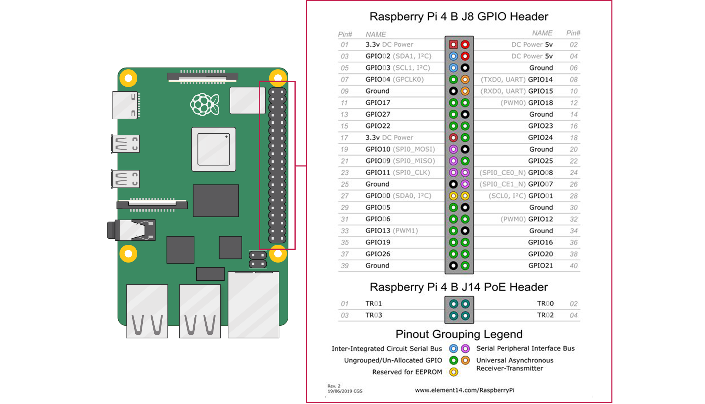

RPi LED
======

#### Version: 0.2.0-beta

Overview
---
This is a simple system to control programmable LED strip(s) with a Raspberry Pi. 
The system includes a Flask app for user control.


Hardware
---
#### Required Hardware:
```
- Raspberry Pi (Im using a Pi 4 Model B)
- WS2812B LED Strip(s)
- 5v PSU (~5amp/strip in my case)
- Wires to connect it all together
```

#### PI 4 Model B GPIO Pin Layout:


#### Connecting Power:
The PSU should be plugged directly into the positive and negative ends of the LED strips.
Ground should also go from each strip into the Pi itself through any ground pin. Finally the Pi
should be powered through its usual power port (USB-C for Pi 4 Model B). If you need more help,
https://www.youtube.com/watch?v=Pxt9sGTsvFk is a great quick start video.

#### Connecting Strips to Pi:
The connection from the stips to the Pi is simple. You must use a GPIO port that supports PMW. In my case, 
I have two strips, so I used the GPIO12 and GPIO18 pins for the data connection. This is reflected in 
src/config.py. If you set your data ports up differently for some reason, or only have one strip, you 
will have to update src/config.py and possibly (probably not) the strip formation in src/ledapp.py.


Installation and Startup
---
### Web Panel / API
On the first controller you have, you will also need to run the web panel. It is recommended that this is run on
your most powerful Pi, and therefore you use the most powerful Pi you have as your first controller.
The web panel is simple to run, it is recommended that you create a directory in your user home directory on your
Pi, such as `leds`, to copy files into. 
To run the web panel, copy the `web` directory from the repo, and navigate to it (recommended to use TMUX at this time,
docker is coming eventually). From there simply run `sudo python3 panel.py`.
Some things to note:
    - You will need to edit the config.py to work with your strip(s), and your internet connection. 
    - This assumes python 3 is installed, and all requirements are filled from requirements.txt. 
    - This also assumes you have forwarded the necessary ports.
    - If you need help with those things, https://pythonprogramming.net/practical-flask-introduction/ and https://www.lifewire.com/how-to-port-forward-4163829 are good resources.

### Controller
On every device with a strip connected, you will need to run both parts of the controller. It is recommended to do 
this through TMUX at this time (docker is coming as mentioned). 
Start by coping the `src` directory from the repo.
#### APP:
Run the app by navigating into the `src` folder and running `sudo python3 app.py`.

#### LEDAPP:
Run the led controller by navigating into the `src` folder and running `sudo python3 ledapp.py`.


Modes
---
#### Block:
Instantly sets the strip to the chosen color(s).

#### Wipe:
Sets the strip to the chosen color(s) by wiping the state.

#### Starlight:
Sets individual LEDs to 'twinkle' like a star (dim on and dim off).

#### Chase:
Sets individual or blocks of LEDs to 'chase' through the strip.

#### Rave:

#### Wave:

#### Breathing:

#### Rainbow:
All the other modes allow for rainbow color settings, but this is something special (it's just a rainbow
wave, but still here cause it inspired a lot).
